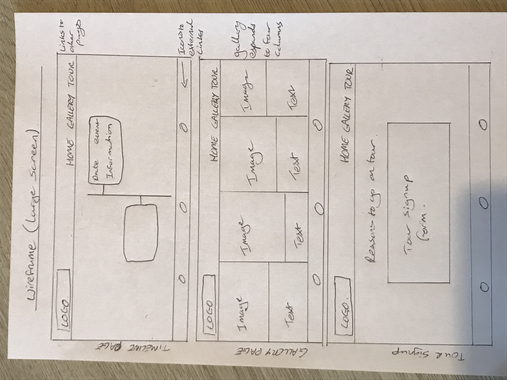
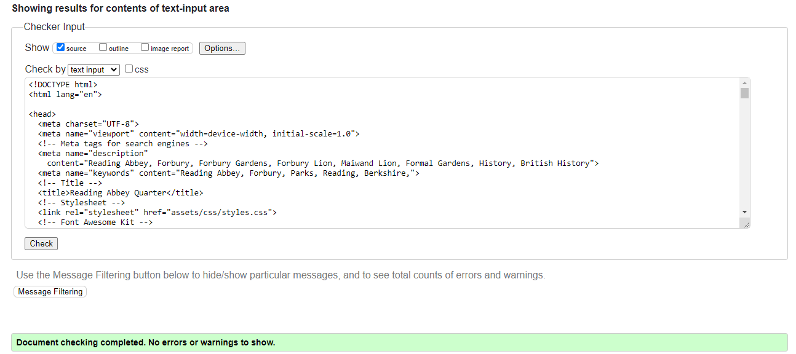

# Reading Abbey Quarter

## Objectives
The aim of this website is to provide information for people who are visiting Reading Abbey Quarter, an area filled with historical interest in the heart of Reading, UK. The site intends to target both people who are specifically interested in aspects of the history of Reading and casual visitors who may be curious about something they may come across. It will provide photographic and textual information so people can match objects and locations with historical events. 

According to [Historic England](https://historicengland.org.uk/research/heritage-counts/heritage-and-economy/visitor-economy/), 3 in 5 adults (63%) visited a heritage site in person in the last 12 months (DCMS, 2023). The most popular heritage visitor sites include visits to parks/gardens with historic features (40%), followed by towns and cities with celebrated histories (39%) (DCMS, 2023). I therefore believe there will be widespread interest in a site of this nature.

In designing the site I have considered the five planes of user experience.

## Scope
In considering the audience, The average curious member of the public, I will create a website which links location and objects with notable historic events.

In order to maintain the focus of the site I will limit the scope to the areas below:

1. events with a corresponding location and object. 
2. Events with a narrow relation to the area, rather than wider town of Reading.

## Structure
As a tourist destination most users will access the site while they are at Reading abbey quarter itself. I will therefore need to design a site suitable for mobile platforms. However I will need this to look good on all formats as it will contain useful information for people planning visits ahead of time.

## Skeleton

All pages will have an identical header and footer. The header will have a recognisable logo and a navigation bar. The navigation bar will be reactive to different screen sizes, with a dropdown on mobile screens and a bar on screens of 768px or higher.  The footer will link to external sites which will help users plan a visit, namely, Reading Museum, Reading bus service and Tripadvisor. I will use icons from Font Awesome so as to save space. The Header and footer will aim to be intuative to use. These open in external tabs so users won't be taken away from the page.

The main content of the site will be accross three pages:

### Page 1.
A timeline of events which places locations and objects in wider context. 

### Page 2.
An image gallery so people can learn more about locations they visit and objects they see. They can match the location and object to the picture and learn in real time.

### Page 3.
A form to sign up to a tour of the area. I hope this will encourage further participation.

### Wireframes
The below wireframes were created as part of the planning and design process to approximate the layout of both mobile and large screen versions.

## Surface. 
I have chosen a warm colour pallete suitable for a heritage themed website. The exact colours were chosen using the eyedropper tool in DevTools based on commonly occuring colours in the images. A silver colour was chosen wherever text needed better contrast with the background. 

A single background image of the Maiwand Lion (the most iconic and well known feature of the location) was chosen to give instant recognition and to tie the site together. The image was processed to make it easier to read any text placed on top. 

# The final site

### The Timeline
The landing page provides a timeline of the most pertinent events. the aim of this site will be to help users contextualise the objects and locations the see with wider historical events they may already know about (such as the dissolution of the monasteries).

### The Gallery
The gallery will have images of the most prominent locations and objects in the abbey quarter with short explanations of what they are. This will help users understand what the things they see during a visit are.

### Tour signup form.
The final page is a form allowing users to signup to a guided tour. The form takes inputs for first and last name and email address. These are mandatory and placeholder text is provided to guide the user. There is also a drop down menu for party size and a calendar with radio buttons to book a day and time. As proof of concept this is currently linked to a the code institute landing page which displays the data submitted. 

## Testing

The site was tested in Chrome and Firefox. Developer tools was used, particularly with Galaxy Z fold 5, Iphone SE and IPad Mini, as well as the responsiveness feature. The full size version was tested on 11 and 22 inch screens. 
 
I have asked three friends for their feedback on the overall design and usability.

### HTML
An unclosed tag was found in testing through the official W3C validator and corrected. All pages were found to be bug free.

#### Timeline validation
 

#### Gallery page validation

#### Tour signup validation

### CSS
No errors were found when passing through the official (Jigsaw) validator

One warning was given, as the validator doesn;t check imported stylings of gooogle fonts:

### Lighthouse
The site was tested in lighthouse. The site performed poorly in the performance category due to the size of the images used. I compressed and reuploaded these and while this did increase load times it is still slower than I would like. The original images were taken by myself and were I to revisit the site I would like to use smaller images to increase user experience.  The report also reccomended resizing some h2 and h3 elements and the addition of some aria lables. This has been done and the scores have improved as can be seen below.

#### Timeline page

#### Gallery page

#### Tour signup page

## Deployment

The application was created on Gitpod using The Code Institute template (https://github.com/Code-Institute-Org/gitpod-full-template) and VS Code Plugin and deployed to Github with the following steps:

1. Login to Github, otherwise create an account.
2. Navigate to the repository ('Explore -> 'ewradcliffe/Reading-Abbey-Quarter') or follow the link (https://github.com/ewradcliffe/Reading-Abbey-Quarter).
3. Once in the repository navigate to the 'Settings' tab.
4. Navigate to the 'Pages' section, select the branch to deploy and save the changes.

The link to website is https://ewradcliffe.github.io/Reading-Abbey-Quarter/

Please note that to save any changes, please save as usual, then 'git add .' followed by 'git commit -m "summerise changes." followed by 'git push' to push changes to github.

## Credits

The  code for the header and Footer were taken from the code institute [Love Running Project](https://codeinstitute.net).

The Timeline was taken from [W3 Schools Timeline lesson](https://www.w3schools.com/howto/howto_css_timeline.asp)

Kevin Powell [box-shadow vs filter: drop-shadow()](https://www.youtube.com/watch?v=8Z9zimqUCzA) was used.

Favicon generated by [Favicon generator](https://www.favicon-generator.org/)

The icons in the header and footer were taken from [Font Awesome](https://fontawesome.com/). Fonts are from [Google fonts](https://fonts.google.com/).

The content is based on content from [Reading Museum](https://www.readingmuseum.org.uk/), [Wikipedia](https://en.wikipedia.org/wiki/Reading_Abbey) and [Berkshire War memorials](http://www.berkswm.org/index.html). 

The Gallery styling was done with the assistance of my Code Institute mentor, Rory Patrick Sheridan.

The Photos are my own, with background image colouring was done by Tanith Griffiths.